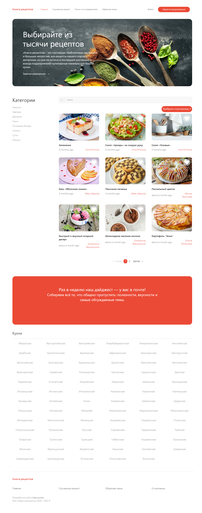

# Diploma
### **:uk:**

## Built With
* [Angular](https://angular.io/) - The front-end web framework used
* [Spring](https://spring.io/) - The back-end web framework used
* [Maven](https://maven.apache.org/) - Dependency Management
* [MySql](https://www.mysql.com/) - Database service
* [UIkit](https://getuikit.com/) - A modular front-end framework for developing web interfaces
* [Mailtrap](https://mailtrap.io/) - A fake SMTP server for development teams to test, view and share emails sent from the development 
* [MapStruct](https://mapstruct.org/) - A code generator

**Database shreme**

**Main page**

**Signup page**

**Login page**

**User account**

**Admim account**

**Edit user account**

**Recipe page**

**Create recipe**

**Edit recipe**

**Search by ingredients (title)**

**Contact**

